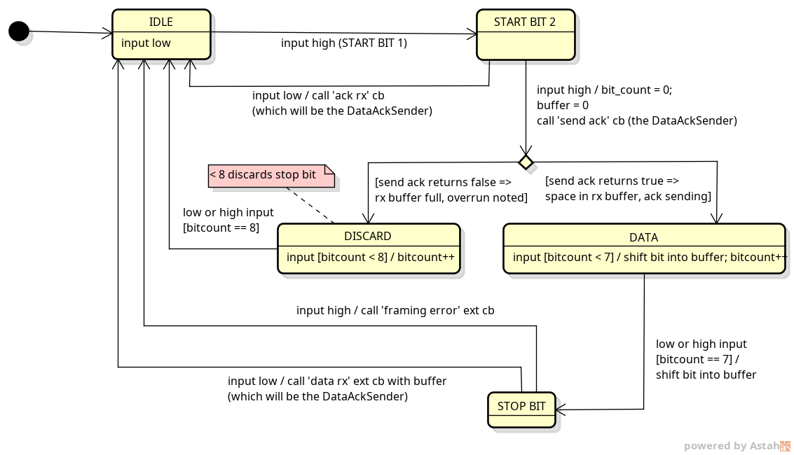

# Asynchronous Link Design
This page describes the high level design of `AsyncLink`, and its subcomponents. 

Up until 26/09/2025, the emulator's
link implementations relied on the operating system and were entirely synchronous. This is not how an actual Transputer
link works - it's asynchronous, meaning that once instructed to receive or transmit some data, it's independent of the
CPU, and transfers the data behind the scenes, signalling the CPU when it's done, so that the sending/receiving
process can be rescheduled.

For communication between Raspberry Pi Pico emulators, using GPIO pins, a properly asynchronous link implementation is
required. This will need the use of links in the emulator to be revised. 

A timer will be used to clock the link
implementations, which will drive their state machines. The interface to the rest of the emulator will be protected
under a mutex, and will be in the form of a status word that can be read or written (with effects). The emulator will
poll this after processing each instruction. Callbacks will be registered at the link, so that when a byte of data has
been transferred successfully, the next byte can be scheduled for transfer, and if that was the final byte, the process
will be rescheduled. In this way, the link abstraction does not need to know anything about process de/re-scheduling.

`AsyncLink` is not a single monolithic class. The various subcomponents of the `AsyncLink` separate the different
parts of the link, introducing 'seams' to enable effective TDD. 

All the classes described here are in the `asynclink.{cpp,h}` files.

## Transmit/Receive Pins I/O

At the lowest level is `TxRxPin`, which is an interface that allows a transmit pin to be set or cleared, and a receive
pin to be read. There will be a `GPIOTxRxPin` that implements this, and uses hardware GPIO pins on the Raspberry Pi
Pico. Tests use a `CrosswiredTxRxPinPair`, which gives a pair of `TxRxPin`s, A and B, where setting A's Tx pin enables
B's Rx pin. Setting B's Tx enables A's Rx. An `AsyncLink` would take a `TxRxPin`, and tests would create two
`AsyncLink`s with the two `TxRxPin`s back-to-back.

## Oversampling and Majority Vote

The implementation uses oversampling to take sixteen samples per bit, with samples 7, 8 and 9 being used to perform majority
voting in determining the actual state of a bit. This is achieved by the decorator implementation `OversampledTxRxPin`
which uses an underlying `TxRxPin` as input and whose output gives solid bit-long values based on the majority vote.
Although the Rx pin of `OversampledTxRxPin` can be used to read this 'cleaned-up' stream of samples, the state of each
bit has been determined by the majority vote, and can be sensed by registering a callback on the `OversampledTxRxPin`,
which will be notified when each bit value has been determined. The first rising edge of an Ack or Data frame is used to
synchronise the position in the middle of the bit where the majority vote takes place. This synchronisation is reset at
the end of an Ack or Data frame.
There are some small trade-offs in this approach documented in its implementation. 

Note that `TxRxPin` has no explicit clock()/poll() method, but its Rx/Tx methods will be called by higher level
abstractions during a clock poll (`OversampledTxRxPin` and `DataAckSender`). The state machines will be driven by a
timer interrupt service routine (ISR).

## State Machines

In the middle of the stack is `DataAckSender` which is a state machine that uses the Tx half of a `TxRxPin` to clock
out an Ack or Data frame, can be queried for its state and will notify a client (the `AsyncLink`) that sent Data has
been Acked, or that the transmission of data has timed out.

The `DataAckReceiver`...

## The AsyncLink

... TBC ...
